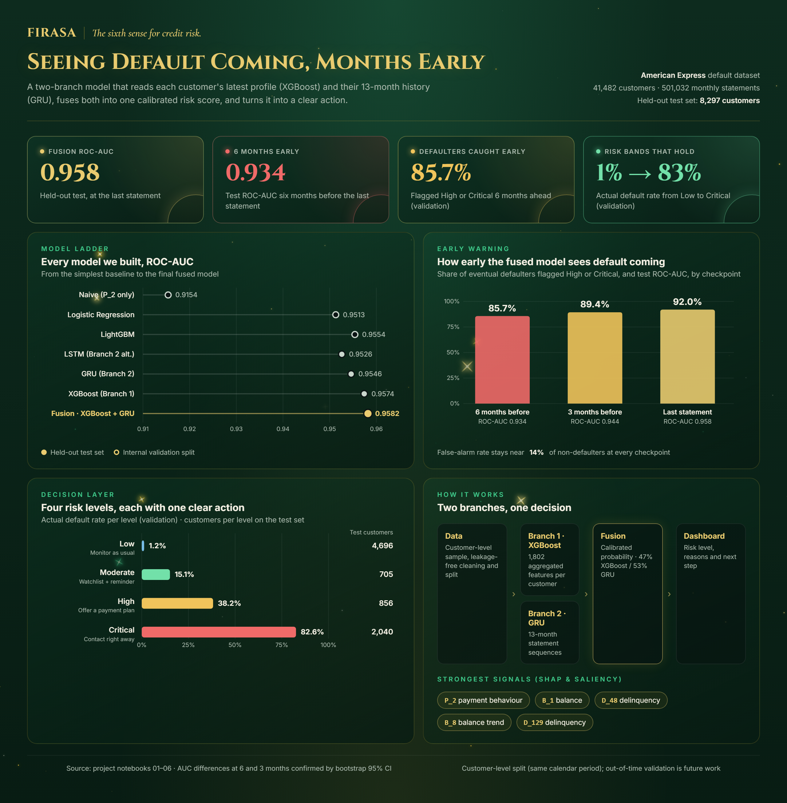

<div align="center">

# FIRASA

*The sixth sense for credit risk.*

**An early-warning system that spots credit-card default months before it happens,
and tells the team what to do about it.**

Data Science Bootcamp capstone · SDA &amp; WeCloudData

</div>

---



## Overview

Banks usually learn that a customer is in trouble when a payment is already missed. Firasa
(Arabic for *insight / intuition*) looks for the signs earlier. It reads every customer's
monthly statements, estimates their probability of default, and sorts them into four risk
levels, each paired with one clear action for the credit team.

The project covers the full path from raw data to a working product:

1. **Exploratory analysis and leakage-free cleaning** of the American Express default dataset.
2. **Two modelling branches**: XGBoost on each customer's aggregated profile, and a GRU on
   their 13-month statement history.
3. **A fusion layer** that combines both branches into one calibrated probability.
4. **An interactive web dashboard** for analysts and managers.

## Key results

All results below are on a **held-out test set of 8,297 customers** that was never used for
training, tuning, or threshold selection, unless marked *validation*.

| Metric | Result |
|---|---|
| Fusion ROC-AUC, last statement | **0.9582** |
| Fusion ROC-AUC, 3 months before the last statement | **0.9443** |
| Fusion ROC-AUC, 6 months before the last statement | **0.9337** |
| Defaulters flagged High/Critical 6 months ahead *(validation)* | **85.7%** at ~14% false alarms |
| Defaulters flagged High/Critical 3 months ahead / at the last statement *(validation)* | **89.4%** / **92.0%** |
| Actual default rate, Low → Critical *(validation)* | **1.2% → 15.1% → 38.2% → 82.6%** |

**Model ladder (ROC-AUC).** Every model had to beat the simpler one before it:

| Model | ROC-AUC | Evaluated on |
|---|---|---|
| Naive baseline (rank by `P_2` only) | 0.9154 | validation |
| Logistic Regression | 0.9513 | validation |
| LightGBM | 0.9554 | validation |
| LSTM (Branch 2 alternative) | 0.9526 | test |
| GRU (Branch 2) | 0.9546 | test |
| XGBoost (Branch 1) | 0.9574 | test |
| **Fusion: XGBoost + GRU** | **0.9582** | test |

The fusion's gain over XGBoost alone is statistically confirmed (bootstrap 95% CI excludes 0)
at 6 months before the last statement (+0.0033) and 3 months before (+0.0022), which is
exactly the early-warning window the project targets. At the last statement the gain is
+0.0008 and the CI's lower bound sits right at zero, so there it is only marginally
confirmed.

**Why GRU over LSTM.** Notebook 05 rebuilds Branch 2 as an LSTM end to end. GRU wins both on
its own (0.9546 vs 0.9526 on test) and once fused with XGBoost (0.9582 vs 0.9578), with a
simpler two-gate cell that trains faster, so GRU stays as Branch 2.

## How it works

```
Amex monthly statements
        │
        ▼
EDA & cleaning ── customer-level sampling, train/test split by customer,
        │         train-only imputation and outlier capping
        ├──────────────────────────────┐
        ▼                              ▼
Branch 1 · XGBoost               Branch 2 · GRU
1,802 aggregated features        13-month sequences, one score per month
        └──────────────┬───────────────┘
                       ▼
        Fusion · logistic regression meta-model
        (calibrated probability, ~47% XGBoost / 53% GRU)
                       ▼
        4 risk levels + recommended action
        Low < 10% · Moderate < 30% · High < 60% · Critical ≥ 60%
                       ▼
                Web dashboard
```

**Explainability.** Branch 1 is explained with SHAP (`TreeExplainer`), Branch 2 with
gradient × input saliency, and the fusion layer through its two coefficients. Payment
behaviour (`P_2`) is the top signal for both branches. Beyond it, XGBoost leans on balance
(`B_1`) and delinquency (`D_48`), while the GRU picks up `B_8`, `D_129` and the
`D_43_was_missing` flag. That difference is why fusing the two beats either one alone.

## The dashboard

A static web app in [`dashboard/`](dashboard/). It needs no backend: it reads the two files
exported by notebook 06, one row per test customer (fused score, risk level, action, top
reasons from each branch and their contribution split) and each customer's monthly GRU
scores.

| Page | What it is for |
|---|---|
| **Home** (`index.html`) | Landing page with the live customer count |
| **Radar** (`radar.html`) | The top 40 customers of each risk level plotted by score; click a point for a quick profile with their monthly GRU trend |
| **Customer Profile** (`profile.html`) | Searchable directory filtered by risk, with a full profile: score, 13-month GRU trend, reasons from both branches, and the next step |
| **Manager Dashboard** (`manager.html`) | Portfolio KPIs, risk mix, action playbook, early warnings (close to Critical, rising fast on the GRU trend), and a priority list with a 3-month GRU trend column and CSV export |

**Reading the numbers.**

- **Score (0–100):** the fused probability × 100, rounded down, so a score always sits inside its level: Low 0–9, Moderate 10–29, High 30–59, Critical 60+.
- **Monthly trends:** the charts and the trend columns come from the GRU alone. It is the only branch that reads a customer month by month, and each month's score uses only the statements up to that month. XGBoost sees one aggregated view of the full history, so it has no monthly curve to show. For that reason the latest point on a trend can differ from the fused score.
- **Trend charts** use a fixed 0–100 scale with the level cut-offs (10, 30, 60) drawn in, so a small move looks small.
- **3-month trend:** the change in the GRU score between the latest month and three months earlier. It means the same on the profile, the radar and the manager dashboard. Moves under 3 points count as flat, and "Rising fast" means up 15 points or more.
- **Short history:** customers with fewer than two months of history show a note instead of a trend.
- **Reasons:** each profile lists the top three reasons from each branch (SHAP for XGBoost, saliency for the GRU) and how much each branch contributed to that customer's fused score.

### Run it locally

Open `dashboard/index.html` directly, or serve the folder over HTTP:

```bash
cd dashboard
python -m http.server 8000
```

and open <http://localhost:8000>. Over HTTP the pages read `data/*.csv`; opened straight from
disk, the browser blocks that, so they read the same data from `data/offline-data.js`. After
changing the CSVs, rebuild that file with `python dashboard/build_offline_data.py`.

The dashboard can also be published as-is with **GitHub Pages**: set the Pages source to the
repository's `dashboard/` folder, or copy its contents to the published branch.

## Project structure

```
Firasa/
├── dashboard/                  # Web dashboard (static HTML/CSS/JS)
│   ├── index.html              #   Home
│   ├── radar.html              #   Risk radar
│   ├── profile.html            #   Customer directory and profile
│   ├── manager.html            #   Manager dashboard
│   ├── assets/                 #   Shared CSS/JS, card images, demo data
│   ├── data/                   #   Exported scores and monthly trajectories (from notebook 06)
│   └── build_offline_data.py   #   Rebuilds data/offline-data.js from the CSVs
├── api/                        # Phase 6: FastAPI scoring service + drift monitor
│   ├── main.py                 #   Endpoints (/predict, /model-info, /monitoring/*, ...)
│   ├── inference.py             #   Loads models/, replays notebook 06's scoring pipeline
│   ├── drift.py                 #   Data drift monitoring (input z-test, output PSI)
│   ├── schemas.py / config.py   #   Request/response models, artifact paths
│   └── README.md                #   Full API + drift-monitoring docs
├── models/                     # Trained artifacts: XGBoost, GRU, scaler, encoder, fusion
├── notebooks/                  # Full modelling pipeline, run in order
├── logs/                       # Drift monitor's JSONL log (git-ignored, created at runtime)
├── Dockerfile / docker-compose.yml   # Containerizes the api/ service (Phase 6)
└── docs/                       # Project summary board (source of the image above)
```

## Notebooks

| # | Notebook | What it does |
|---|---|---|
| 01 | [EDA](notebooks/Firasa_01_EDA.ipynb) | Customer-level sampling, missing-value handling, leakage-free split, feature aggregation, feature dictionary |
| 02 | [Baseline: Logistic Regression](notebooks/Firasa_02_Baseline_LogisticRegression.ipynb) | Naive baselines and a Logistic Regression sanity check |
| 03 | [Branch 1: XGBoost & LightGBM](notebooks/Firasa_03_Branch1_XGBoost_LightGBM.ipynb) | Tree models, 5-fold CV, threshold tuning, held-out test, Branch 1 export |
| 04 | [Branch 2: GRU + Fusion](notebooks/Firasa_04_Branch2_GRU_Fusion.ipynb) | Sequence model, fusion layer, risk levels, calibration, bootstrap CIs, SHAP & saliency |
| 05 | [LSTM vs GRU](notebooks/Firasa_05_LSTM_vs_GRU_Decision.ipynb) | End-to-end LSTM alternative and the final comparison of every model, reading the GRU's test numbers from notebook 04's export |
| 06 | [Dashboard export](notebooks/Firasa_06_Dashboard_Export.ipynb) | Scores every test customer and exports the dashboard's data files |

### Reproducing the results

The notebooks were built for **Google Colab** with Google Drive for intermediate files.

1. Download the [Amex Parquet dataset](https://www.kaggle.com/datasets/odins0n/amex-parquet)
   from Kaggle (notebook 01 does this through the Kaggle API).
2. Run the notebooks in order, 01 → 06. Each one reads the files the previous one saved;
   notebook 04 also writes `branch2_gru_test_summary.json`, which notebook 05 reads.
   Notebooks 04 and 05 turn on deterministic TensorFlow ops, so start them from a fresh
   runtime to get the same GRU/LSTM results on every run.
3. Copy the two CSVs exported by notebook 06 into `dashboard/data/`, then run
   `python dashboard/build_offline_data.py`.

Main libraries: `pandas`, `polars`, `scikit-learn`, `xgboost`, `lightgbm`, `tensorflow`/`keras`,
`shap`, `matplotlib`, `seaborn`.

## Phase 6: model serving API, Docker & drift monitoring

The proposal's Phase 6 ("Containerize the model via Docker, expose it using a REST API
(FastAPI), and establish monitoring tools to track data drift over time") lives in
[`api/`](api/) — all three parts are implemented. It's a FastAPI service that loads the
trained XGBoost, GRU, and fusion artifacts from `models/` and replays the same scoring
pipeline `notebooks/Firasa_06_Dashboard_Export.ipynb` runs in bulk, per customer, on
demand, and logs every prediction to a rolling drift monitor.

```bash
cd Firasa
docker build -t firasa-api .
docker run --rm -p 8000:8000 firasa-api
# or, to persist drift history across restarts:
docker compose up --build
```

Verified end to end, including a real `docker build`/`docker run` on Windows with Docker
Desktop (not just this project's dev sandbox, whose network policy blocks container
registries) — see [`api/README.md`](api/README.md#verified-so-far).

`GET /monitoring/drift` reports Population Stability Index-style drift for the predicted
risk levels and a mean-shift test for the model's most important input features, both
against real reference numbers from the training artifacts and the held-out test set —
see [`api/README.md`](api/README.md#data-drift-monitoring) for the method and why input
and output drift are scored differently.

See [`api/README.md`](api/README.md) for the request format, a ready-made sample request,
and what's in scope versus a possible next step (live scoring from raw statement rows,
Branch-1 input drift). Cloud deployment (Azure) is planned as the next step after this.

## Limitations

- **Customer-level split, not out-of-time.** Train, validation, and test contain different
  customers but cover the same calendar period (March 2017 to March 2018). The results show
  generalisation to new customers, not yet to future months. A time-based split is the natural
  next step.
- **Sample, not the full dataset.** Models were trained on about 41,000 of the ~459,000
  customers to fit Colab's memory limits.
- **Display names are pseudonyms**, generated deterministically from each customer ID for the
  demo. They are not real people.

## Team

### Noura Mesfer Alzahrani 
### Layan Fahad Alhumaidi 
### Abeer Mohammed Alshahrani 


## Acknowledgements

Built as the capstone project of the Data Science Bootcamp by **SDA** and **WeCloudData**.
Data: the American Express Default Prediction competition, via the
[Amex Parquet](https://www.kaggle.com/datasets/odins0n/amex-parquet) dataset on Kaggle.
